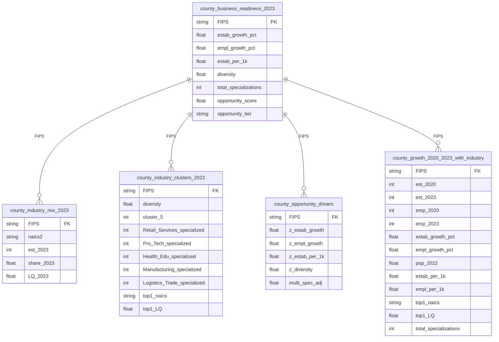
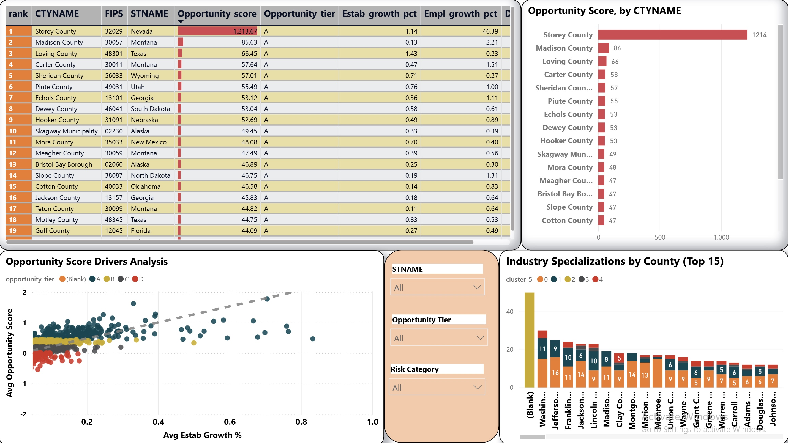
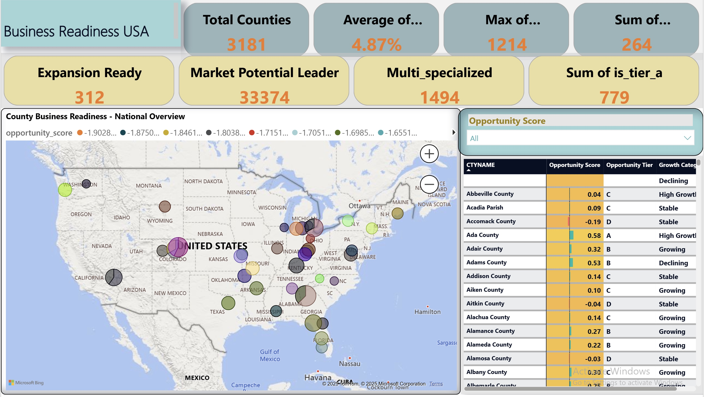
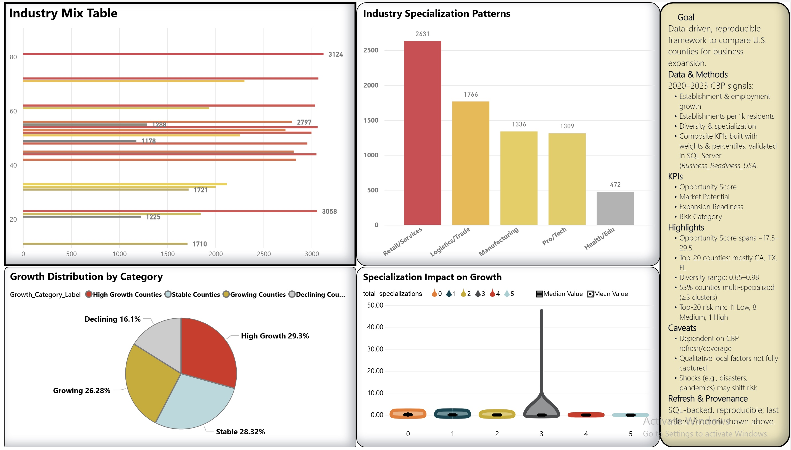

# Business Readiness USA — County Expansion Analytics

Clean, auditable analytics to identify the best US counties for business expansion. Data engineered in Python, modeled for SQL/BI, and delivered with clear, decision‑ready outputs.

## 📺 Business Analytics Deep Dive

<iframe src="https://player.vimeo.com/video/1120035562?h=89ea5e49a9&amp;badge=0&amp;autopause=0&amp;player_id=0&amp;app_id=58479" frameborder="0" allow="autoplay; fullscreen; picture-in-picture; clipboard-write; encrypted-media; web-share" referrerpolicy="strict-origin-when-cross-origin" style="position:absolute;top:0;left:0;width:100%;height:100%;" title="New Recording - 9/19/2025, 4:44:33 PM"></iframe>

*County ranking methodology & expansion strategy demonstration - US business readiness analysis*

## Quick links

- Notebook: `Business_Readiness_USA.ipynb`
- SQL logic: `county_business_readiness_sql/`
- Screenshots: `screenshots/`
- Dataset (CBP 2020–2023 + Census population): [Google Drive](https://drive.google.com/drive/folders/1dgOh9Ek3PHLVu7hQ_Kt7hpJ7LANWfHvU?usp=drive_link)

---

## Background & Overview

This project evaluates and ranks all US counties using growth, structure, and specialization signals to support expansion planning. The goal is to transform raw County Business Patterns (CBP) and Census population data into a transparent "Opportunity Score" and tiering system that helps business and strategy teams answer:

- Where should we expand next?
- Which places are resilient vs. high‑risk?
- Which industry mixes underpin durable establishment and employment growth?

The output includes ranked county tables, specialization profiles, and geo‑ready layers suitable for BI dashboards.

---

## Data Structure Overview

- Sources
  - CBP county files (2020–2023): establishments and employment by NAICS.
  - Census county population (2024 release): total population by county; 2022 used for per‑capita normalization.

- Core outputs (CSV/GeoJSON/Parquet where relevant)
  - `county_business_readiness_2023.csv`: master table with Opportunity Score, tier, growth, per‑capita density, diversity, specialization summary, top industry LQ.
  - `county_industry_mix_2023.csv`: county × NAICS‑2 establishments, shares, and LQ.
  - `county_industry_clusters_2023.csv`: k‑means cluster (k=5), specialization flags, mean shares by strategy bucket.
  - `county_opportunity_drivers.csv`: z‑scored inputs used in scoring (clipped ±3) for auditability.
  - `county_growth_2020_2023_with_industry.csv`: growth panel and top‑5 NAICS LQs per county.

- Key columns (selected)
  - `FIPS` (text 5): primary key across all outputs; zero‑padded.
  - `estab_growth_pct`, `empl_growth_pct`: 2020→2023 percentage change (county totals).
  - `estab_per_1k`, `empl_per_1k`: 2023 per‑capita density using 2022 population.
  - `diversity`: 1 − HHI over NAICS‑2 shares (higher = more diverse).
  - `top1_naics`, `top1_LQ_capped`: dominant NAICS‑2 and capped LQ (≤10).
  - `opportunity_score`, `opportunity_tier`: composite score and A/B/C/D banding.

- Methods (Python highlights)
  - Type‑safe ingestion, FIPS normalization, robust NAICS filtering.
  - Location Quotients (county share / US share) with outlier capping at 10.
  - Diversity (HHI) computed on NAICS‑2 shares; row‑normalized matrices.
  - K‑means clustering (k=5) on share vectors to profile economic types.
  - Scoring via weighted z‑scores (clipped ±3):
    - Weights: establishments growth 0.35, employment growth 0.20, establishments per‑1k 0.20, diversity 0.15, multi‑specialization (≥2) 0.10.
    - If industry features are missing, diversity and multi‑specialization contributions are set to 0.

- Key terms & abbreviations
  - FIPS: Federal Information Processing Series county code (5‑char text).
  - NAICS‑2: 2‑digit industry code.
  - LQ: Location Quotient (county share ÷ US share), capped at 10 for reporting.
  - HHI: Herfindahl–Hirschman Index; diversity = 1 − HHI.
  - per‑1k: per 1,000 residents (population = 2022).

ERD (logical view)

---

## Executive Summary

**Accomplished [X] as measured by [Y] by doing [Z]**

*Example format:*
- **X**: Improved customer retention by 15%
- **Y**: using an Excel KPI dashboard
- **Z**: By data-driven email marketing campaigns

This pipeline ranks 3,181 US counties and produces geo‑ready outputs for BI. Tiering concentrates attention: 314 Tier‑A and 626 Tier‑B counties (50 with incomplete industry features flagged). Average 2020→2023 establishment growth is ~4.9% and employment growth ~6.0%. Results are audit‑ready (z‑scored inputs, LQ caps) and mapped for 3,131 counties.

---

## Insights Deep Dive

- **Growth dynamics**: Mean establishment growth 4.9% (median 3.7%); mean employment growth 6.0% (median 3.0%).
- **Per‑capita density**: Establishments per‑1k mean 118.6 (range ~9.1 to ~1085.1); employment per‑1k mean 1,372.4 (range ~51.9 to ~23,361.7). Small‑population counties can exhibit extreme per‑capita and LQ values.
- **Diversity (structure)**: HHI mean 0.120 (diversity mean 0.880; median 0.899). Lower HHI is associated with more balanced industry mixes.
- **Specialization coverage (LQ ≥ 1.25)**: Retail/Services 83.1%, Logistics/Trade 55.7%, Manufacturing 42.3%, Pro/Tech 41.3%, Health/Edu 15.0%. 2,540 counties show multi‑specialization (≥2 buckets).
- **LQ outliers**: 824 counties hit the LQ cap of 10 for their top industry; capping is applied to stabilize comparisons and visuals.
- **Geo join coverage**: 3,131 of 3,235 county polygons matched; 50 are listed in `exports/missing_geometry_counties.csv` for follow‑up.

---

## Recommendations

- **Prioritize Tier‑A markets** for immediate expansion; short‑list Tier‑B counties with multi‑specialization and strong per‑capita density.
- **Target segments by specialization** (e.g., Logistics/Trade and Retail/Services) with tailored outreach and partner development.
- **Balance specialization with diversity**: favor counties with strong LQs but moderate HHI (higher diversity) to mitigate sector risk.
- **Monitor low‑growth counties** with high specialization for signs of structural change; consider staged entry or partnerships.
- **Operationalize**: load the master table into your data warehouse and plug into BI for ongoing refresh (retain LQ caps and z‑score clipping for stability).

---

## Caveats & Assumptions

- CBP suppressions (`N`) are treated as missing; totals exclude NAICS "all‑sector" roll‑ups.
- Population uses Census 2022 (AGEGRP=0) for per‑capita normalization.
- LQs are capped at 10 to reduce dominance of small‑base counties; counts of capped observations are disclosed.
- 50 counties did not join to geometry in the 2022 county shapefile; see `exports/missing_geometry_counties.csv`.
- Some micro counties exhibit extreme per‑capita/LQ metrics due to very small populations; interpret paired with diversity and growth.
- Scoring inputs are z‑scored with clipping (±3); counties lacking industry features have diversity/multi‑specialization contributions set to 0.

---

### Screenshots (selected)

- Business Readiness Overview Dashboard  
  
- County Rankings & Opportunity Analysis  
  
- Industry Growth Distribution Analysis  
  

---

Contact: `ozzy2438` (GitHub)
